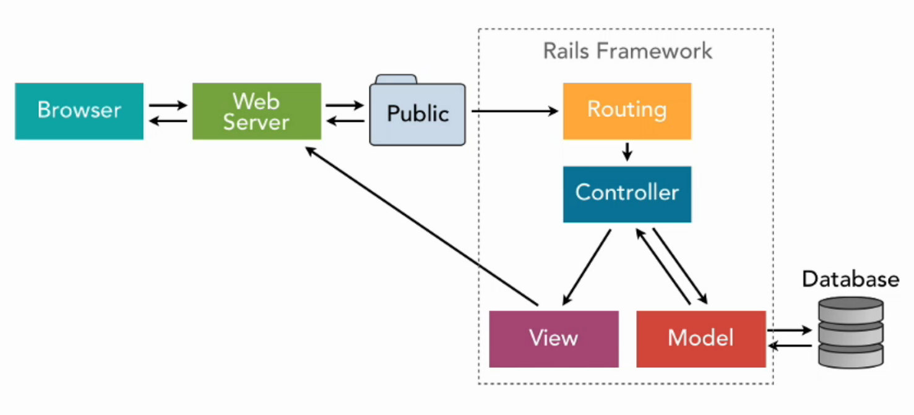

## Ruby on Rails Cheatsheet

### Architecture

**MVC** is a pattern for the architecture of a software application. It separates an application into the following components:

**Models** for handling data and business logic
**Controllers** for handling the user interface and application
**Views** for handling graphical user interface objects and presentation
