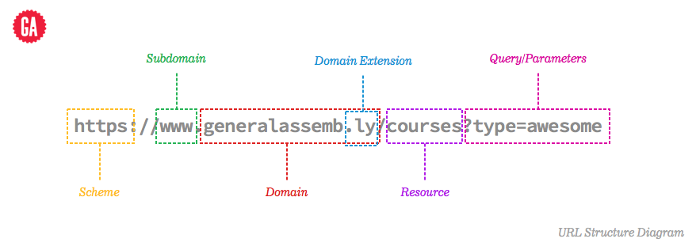

### Routes

Create a route that maps a URL to the controller action

```rb
# config/routes.rb
get 'welcome' => 'pages#home'
```

Shorthand for connecting a route to a controller/action
```rb
# config/routes.rb
get 'photos/show'

# The above is the same as: 
get 'photos/show', :to 'photos#show'
get 'photos/show' => 'photos#show'
```

Automagically create all the routes for a RESTful resource

```rb
# config/routes.rb
resources :photos 
```



HTTP Verb | Path | Controller#Action | Used for
--------- | ---- | ----------------- | -------
GET | /photos | photos#index | display a list of all photos
GET | /photos_new | photos#new | return an HTML form for creating a new photo
POST | /photos | photos#create | create a new photo
GET | /photos/:id | photos#show | display a specific photo
GET | /photos/:id/edit | photos#edit | return an HTML form for editing a photo
PATCH/PUT | /photos/:id | photos#update | update a specific photo
DELETE | /photos/:id | photos#destroy | delete a specific photo

Create resources for only certain actions 

```rb
# config/routes.rb
resources :photos, :only => [:index]

# On the flip side, you can create a resource with exceptions 
resources :photos, :except => [:new, :create, :edit, :update, :show, :destroy]
```

Create a route to a static view, without an action in the controller

```rb
# config/routes.rb
# If there's a file called 'about.html.erb' in 'app/views/photos', this file will be 
#   automatically rendered when you call localhost:3000/photos/about
get 'photos/about', to: 'photos#about'
```

Reference: http://guides.rubyonrails.org/routing.html
